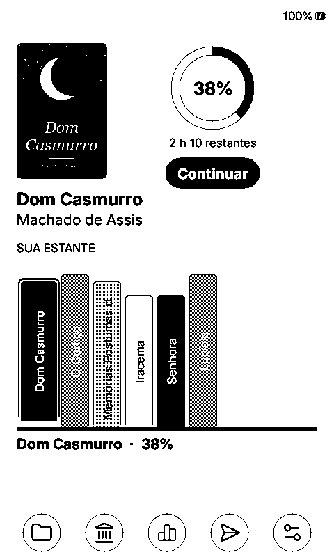
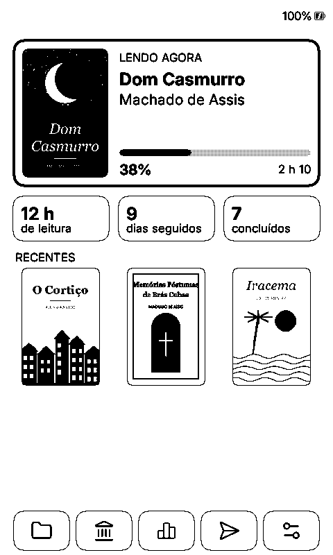
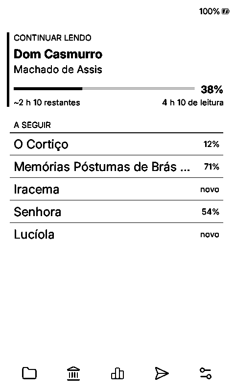
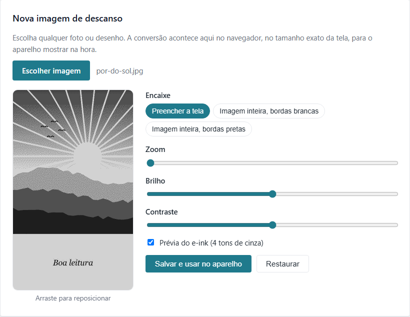
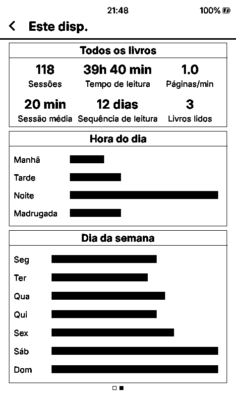
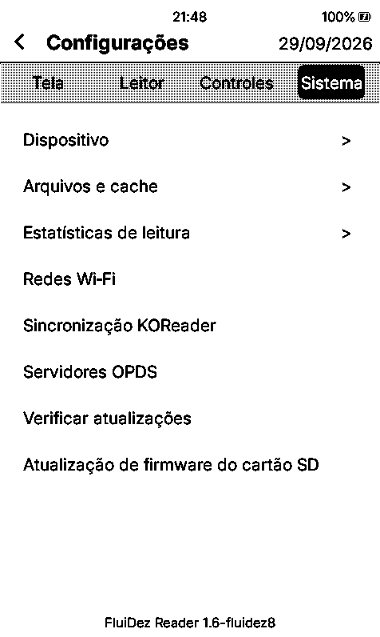

<p align="center">
  <picture>
    <source media="(prefers-color-scheme: dark)" srcset="docs/brand/fluidez-lockup-dark.png">
    
  </picture>
</p>

<p align="center">
  <strong>A leitura flui.</strong><br>
  Firmware de leitura para e-readers Xteink: rápido, econômico na bateria, com temas próprios e a sua imagem na tela de repouso.
</p>

<p align="center">
  <a href="https://github.com/micheljatuba/FluiDez-Reader/releases/latest"></a>
  <a href="https://github.com/micheljatuba/FluiDez-Reader/actions/workflows/ci.yml"></a>
  <a href="LICENSE"></a>
</p>

> [!WARNING]
> **Instalação e atualizações por sua conta e risco.** A MJ Cloud Tecnologia não se responsabiliza por danos ao aparelho, perda de dados ou qualquer outro problema decorrente da instalação, da atualização ou do uso do FluiDez Reader.
>
> **Testado apenas no Xteink X4 Pro.** Os firmwares dos outros leitores (X3, X4, X4 Classic e Seeed Studio Sticky) são gerados a partir do mesmo código, mas não foram testados.

## Sobre

O **FluiDez Reader** é um firmware de código aberto para leitores de tinta eletrônica (e-ink). Ele nasceu como fork do [CrossInk](https://github.com/uxjulia/crossink), que por sua vez é baseado no [CrossPoint Reader](https://github.com/crosspoint-reader/crosspoint-reader), e é modificado e mantido de forma independente por MJ Cloud Tecnologia.

O nome junta *flui* (a leitura flui) e *dez* (nota dez). A identidade visual, os recursos e as correções descritos abaixo são do FluiDez Reader. A visão e o escopo do projeto estão em [SCOPE.md](SCOPE.md).

## Destaques da versão 1.6-fluidez14

### Uma tela Início com a cara do FluiDez

Três temas próprios, feitos para a tela de tinta eletrônica: contraste alto, texto que não corta e um menu de ícones no rodapé. Eles mostram o progresso, o tempo restante e as estatísticas sem ler nada do cartão enquanto desenham, por isso o *Início* abre na hora.

<table>
  <tr>
    <td align="center"><br><sub><b>Estante</b> (padrão)</sub></td>
    <td align="center"><br><sub><b>Cartões</b></sub></td>
    <td align="center"><br><sub><b>Fluxo</b></sub></td>
  </tr>
</table>

- **Estante:** a capa do livro atual, o progresso num anel e uma estante com as lombadas dos recentes. Escolha uma lombada e ela sobe, com o nome e o progresso logo abaixo.
- **Cartões:** o livro atual, o tempo de leitura, os dias seguidos e os livros concluídos, cada um no seu cartão, mais as capas recentes.
- **Fluxo:** só texto, sem ler nenhuma capa. É o *Início* mais rápido de todos.

Troque em **Configurações > Tela > Tema da interface**. Quem já usa outro tema continua com ele depois de atualizar.

### Qualquer imagem na tela de repouso

Seu personagem favorito, a foto do seu cachorro, aquele desenho que você ama: abra `http://fluidez.local/sleep` no celular ou no computador, escolha a imagem, ajuste o enquadramento, o zoom, o brilho e o contraste e veja na hora como ela vai ficar em tons de cinza. Toque em **Salvar e usar no aparelho** e pronto: na próxima vez que você bloquear o leitor, é ela que aparece.

<table>
  <tr>
    <td align="center"><br><sub>Editor no portal web</sub></td>
    <td align="center"><br><sub>No leitor</sub></td>
  </tr>
</table>

A conversão acontece no navegador, no tamanho exato da tela, e o leitor só exibe o arquivo pronto: nenhum processamento a mais no aparelho. Fotos JPG e PNG copiadas direto para a pasta `sleep` do cartão também funcionam; o leitor converte cada uma uma vez e depois ela abre tão rápido quanto um BMP.

## Mais telas

Imagens do simulador do X4 Pro, com a interface em português. Os livros de exemplo são clássicos brasileiros em domínio público, com capas criadas para estas imagens.

<table>
  <tr>
    <td align="center"><br><sub>Início (Lyra Grade)</sub></td>
    <td align="center"><br><sub>Início (Lyra Carousel)</sub></td>
    <td align="center"><br><sub>Leitura</sub></td>
  </tr>
  <tr>
    <td align="center"><br><sub>Estatísticas de leitura</sub></td>
    <td align="center"><br><sub>Configurações</sub></td>
    <td align="center"><br><sub>Tela de repouso</sub></td>
  </tr>
</table>

## O que o FluiDez Reader traz

### Início e biblioteca

- **Temas FluiDez e imagem de repouso própria:** veja os [destaques](#destaques-da-versão-16-fluidez14).
- **Livros fixados:** fixe até seis livros no topo de *Livros recentes*. Eles ficam na ordem em que foram fixados, logo depois de *Continuar lendo*, e continuam na lista quando livros mais antigos ou concluídos saem dela.
- **Menu do livro no Início:** segure a capa de um livro para *Fixar no topo* ou *Desafixar*, *Marcar como concluído* ou *Remover dos Livros recentes*, sem sair do *Início*. Em leitores sem toque, segure *Confirmar* sobre o livro selecionado.
- **Tema Lyra Grade:** grade 3x2 com seis livros (o atual, os fixados e os recentes), cada um com barra de progresso e uma fita nos fixados.
- **Lyra Carousel:** mostra até cinco livros, dois de cada lado da capa selecionada.
- **Painel:** estatísticas com rótulos curtos e maiores ("Leitura", "Restante", "Previsão") que quebram linha em vez de serem cortados, em um layout que não invade a capa, o título nem o rodapé.

### Bateria e resposta

- Teclado, escolha de Wi-Fi, transferência e sincronização Nearby e o resultado do download de fontes respeitam o *Tempo para repousar* quando ficam parados.
- Telas de espera (limpeza de cache, backup de estatísticas, ajuste do relógio, atualização de firmware, download de fontes), o *Bloqueio rápido* e os atalhos não deixam a CPU em velocidade máxima.
- O toque responde mais rápido depois que a tela fica parada.
- A contagem para repousar só começa quando downloads longos e limpezas terminam, para o resultado ficar visível.

### Confiabilidade

- As estatísticas de cada livro sobrevivem a uma falha do cartão SD durante a gravação.
- O gerenciador de arquivos web aceita pastas com `%` no nome, e o envio de arquivos diferencia arquivos otimizados, originais enviados após falha na otimização e envios com erro.
- Renomear pelos metadados do EPUB escolhe o autor, e não o tradutor.

### E mais

- **Identidade própria:** símbolo e logotipo nas telas de inicialização e de repouso, no rodapé das Configurações, no nome do aparelho e no portal web. Veja a [identidade visual](docs/brand/README.md).
- **Cinco famílias de fontes extras** para o cartão SD: Gelasio, EB Garamond, Crimson Pro, Jost e Arimo ([como gerar](#fontes-extras)).
- **Português e inglês** embutidos no firmware.
- **Atualizações por este repositório:** *Verificar atualizações* instala as versões publicadas aqui.
- **Plugin próprio para o Calibre** e nomes de rede próprios: o portal web atende em `http://fluidez.local/` e o hotspot do leitor se chama `FluiDez-Reader` (veja [Calibre](#calibre)).

As novidades de cada versão, em português, estão em [NOVIDADES](NOVIDADES.md) e na [página de versões](https://github.com/micheljatuba/FluiDez-Reader/releases). O histórico técnico completo, em inglês, está no [CHANGELOG](CHANGELOG.md).

## Recursos herdados

Do CrossInk e do CrossPoint Reader, o FluiDez Reader herda, entre outros:

- leitura de EPUB (com hifenização, tabelas, imagens e modos de renderização), TXT e XTC;
- fontes de leitura embutidas (Lexend Deca e Bitter) e fontes extras no cartão SD;
- dicionário offline, marcadores, recortes, *Leitura focada* e Guide Dots;
- estatísticas de leitura e telas de repouso personalizáveis;
- transferência de arquivos por Wi-Fi (portal web com otimizador de EPUB, WebDAV, Calibre e OPDS), *Unidade USB* e transferência Nearby;
- sincronização de progresso com o KOReader e entre dois leitores;
- atalhos, mapeamento de botões e gestos de toque configuráveis.

Os detalhes estão na [documentação](docs/index.md) (em inglês).

## Aparelhos

| Aparelho | Arquivo do firmware | Situação |
| --- | --- | --- |
| Xteink X4 Pro | `firmware-x4-pro-v<versão>.bin` | Testado |
| Xteink X4 Classic | `firmware-x4-classic-v<versão>.bin` | Não testado |
| Xteink X3 e X4 | `firmware-x3-x4-v<versão>.bin` | Não testado |
| Seeed Studio Sticky | `firmware-sticky-v<versão>.bin` | Não testado |

## Instalação

A instalação é feita por sua conta e risco. Antes de começar, carregue a bateria e não desligue o leitor durante a gravação.

1. Baixe o arquivo do seu aparelho na [última versão](https://github.com/micheljatuba/FluiDez-Reader/releases/latest).
2. Copie o `.bin` para qualquer pasta do cartão SD.
3. No leitor, abra **Configurações > Sistema > Atualização de firmware do cartão SD**, escolha o arquivo e confirme.

Se o leitor ainda usa o firmware original do CrossInk, a primeira instalação precisa ser feita assim (ou por USB), porque o firmware original procura atualizações no repositório do CrossInk. Para gravar pelo computador, veja o [guia de instalação](docs/installation.md) (em inglês).

## Atualizações

Depois da primeira instalação, use **Configurações > Sistema > Verificar atualizações**. O leitor consulta a versão mais recente publicada neste repositório e instala o firmware do seu aparelho. As atualizações também são feitas por sua conta e risco, e o próprio leitor exibe esse aviso antes de instalar.

## Calibre

Para enviar livros do Calibre pela rede Wi-Fi, use o plugin **FluiDez Reader** para Calibre:

1. Baixe o [`fluidez-reader-calibre-plugin.zip`](https://github.com/micheljatuba/FluiDez-Reader/releases/latest/download/fluidez-reader-calibre-plugin.zip), anexado a cada versão.
2. No Calibre, abra **Preferências > Plugins > Carregar plugin a partir de arquivo**, escolha o ZIP (sem extrair) e reinicie o Calibre.
3. No leitor, abra **Transferência de arquivos > Calibre sem fio** e, no Calibre, use **Enviar para o dispositivo**.

Mais detalhes, configurações e solução de problemas estão no [README do plugin](calibre-plugin/README.md).

## Fontes extras

As famílias Gelasio, EB Garamond, Crimson Pro, Jost e Arimo não estão no catálogo de download de fontes do aparelho. Gere-as no computador, a partir de uma cópia deste repositório (requer Git e Python 3):

```sh
git clone https://github.com/micheljatuba/FluiDez-Reader.git
cd FluiDez-Reader
python3 -m pip install -r lib/EpdFont/scripts/requirements.txt
python3 lib/EpdFont/scripts/build-sd-fonts.py --only Gelasio,EBGaramond,CrimsonPro,Jost,Arimo --output-dir ./generated-fonts
```

Depois, copie as pastas das famílias geradas para `/.fonts/` (ou `/fonts/`) no cartão SD. Mais detalhes em [SD card fonts](docs/sd-card-fonts.md).

## Dicas para uma boa leitura

- Mantenha as pastas com menos de 200 arquivos (o ideal é de 50 a 100). Mil livros ou mais funcionam bem se estiverem divididos em pastas, por autor, série ou gênero.
- Evite deixar todos os livros na raiz do cartão: o navegador de arquivos precisa ler e ordenar a pasta inteira antes de mostrá-la.
- EPUBs com foco em texto funcionam melhor. Arquivos com muitas imagens grandes, livros escaneados, quadrinhos e coletâneas enormes podem ficar lentos ou falhar por falta de memória.
- Como referência, EPUBs com menos de 20 MB funcionam melhor; acima de 50 MB, a chance de lentidão aumenta.
- Se um EPUB estiver lento, envie-o pelo otimizador de EPUB do portal web (em *Transferência de arquivos*).
- Use um cartão SD confiável e deixe espaço livre: configurações, progresso, cache e estatísticas ficam no cartão.

## Contribuições

O código é público, mas o desenvolvimento é fechado: no momento, o FluiDez Reader não aceita issues, pull requests nem outras contribuições externas.

## Créditos

O FluiDez Reader existe graças a:

- [CrossInk](https://github.com/uxjulia/crossink), de Julia Nguyen, a base direta deste projeto;
- [CrossPoint Reader](https://github.com/crosspoint-reader/crosspoint-reader), de Dave Allie e colaboradores, o projeto original;
- [plugins do CrossPoint Reader para o Calibre](https://github.com/crosspoint-reader/calibre-plugins), a base do plugin FluiDez Reader para Calibre.

O histórico do CrossInk faz parte deste repositório desde a sincronização de outubro de 2026, e as mudanças trazidas de lá estão no [CHANGELOG](CHANGELOG.md).

## Licença

[MIT](LICENSE). O aviso de copyright original foi mantido. Como prevê a licença, o software é fornecido "no estado em que se encontra", sem garantias de qualquer tipo.
