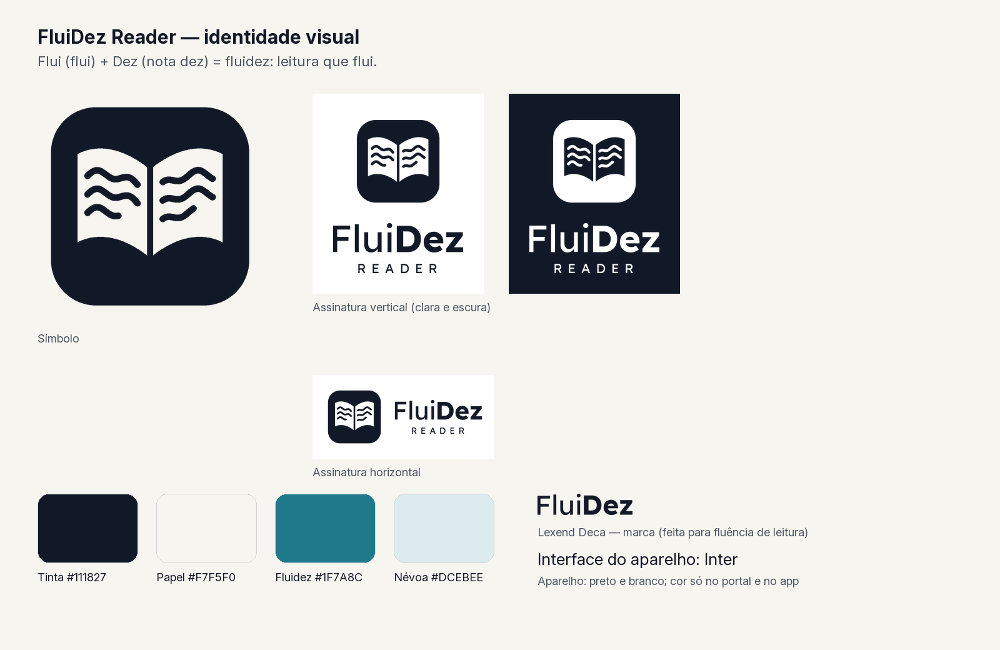

# FluiDez Reader — identidade visual

**FluiDez** junta *flui* (a leitura flui) e *dez* (nota dez) na palavra
*fluidez*. A marca é uma personalização da CrossInk, que por sua vez deriva
do CrossPoint Reader (licença MIT).

## Símbolo

Um livro aberto dentro de um quadrado arredondado. O alto das páginas se curva
como uma onda e as linhas de texto ondulam de uma página para a outra, como se
a leitura escorresse. O desenho é feito só de formas cheias e traços de pelo
menos 3 px a 120 px, para ficar nítido na tela e-ink em preto e branco.

| Arquivo | Uso |
| --- | --- |
| [fluidez-symbol.svg](./fluidez-symbol.svg) | Original vetorial |
| [fluidez-symbol-512.png](./fluidez-symbol-512.png) | Ícone de app e redes |
| [fluidez-lockup.png](./fluidez-lockup.png) | Assinatura em fundo claro |
| [fluidez-lockup-dark.png](./fluidez-lockup-dark.png) | Assinatura em fundo escuro |

## Tipografia

- **Marca:** Lexend Deca, criada para melhorar a fluência de leitura.
  "Flui" em Regular e "Dez" em Bold, com "READER" espaçado abaixo.
- **Interface do aparelho:** Inter, a fonte que o firmware já usa.

## Cores

| Nome | Cor | Uso |
| --- | --- | --- |
| Tinta | `#111827` | Símbolo, textos |
| Papel | `#F7F5F0` | Fundos claros |
| Fluidez | `#1F7A8C` | Destaque no portal web e no app |
| Névoa | `#DCEBEE` | Fundos de destaque suaves |

No aparelho a marca é sempre preta sobre branco, ou invertida na tela de
repouso escura. As cores valem só para telas coloridas.

## Onde aparece

- Telas de inicialização e de repouso padrão (`FluiDezBrand::drawLockup`).
- Rodapé de versão em Configurações e nome padrão do aparelho.
- Portal web: logotipo, título das páginas, rodapé e cor de destaque.

Identificadores técnicos continuam os mesmos: nome de rede `crosspoint`,
caminhos `/.crossink-*`, dados USB e formatos de arquivo.

## Como gerar de novo

Tudo sai de uma única fonte geométrica. Depois de mudar o desenho:

    python scripts/generate_brand_assets.py

O script (requer Pillow) regrava `src/images/FluiDezLogo.h`,
`web/assets/logo.png` e esta pasta. Use `--preview PASTA` para testar sem
alterar o repositório.
